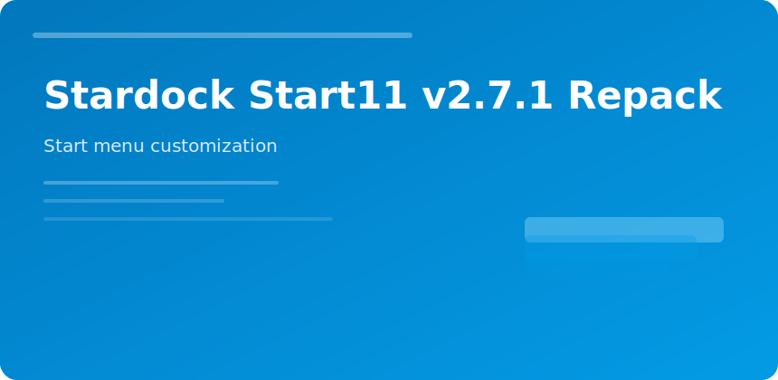

  

  

## Stardock Start11 v2.7.1

Restores **Windows 10-style Start** behaviors on Windows 11 without registry hacking.

### Customization list

- Start alignment left/center
- Taskbar size and grouping
- Unpin default promoted apps
- Search provider choice
- Context menu style

### v2.7.1 notes

Improved multi-monitor taskbar sync and fix for pinned folder flyout delay on slow profiles.

### Rollback

Export settings before major Windows feature updates; Stardock releases compatibility builds quickly but keep a restore point.

stardock start11 start menu taskbar windows customization
